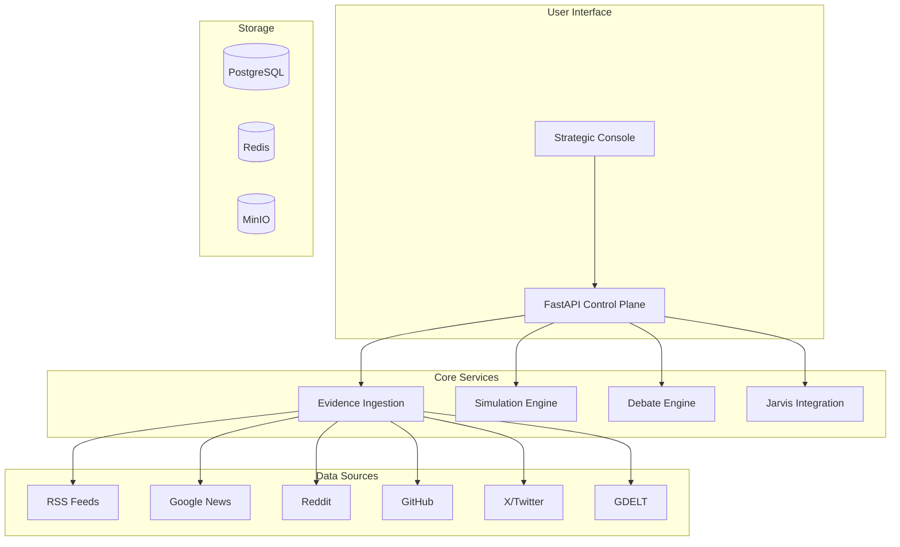

<div align="center">

# 明鉴 (MingJian)

### *See Clearly, Judge Wisely*

**AI-Powered Multi-Agent Platform for Evidence-Driven Scenario Simulation & Strategic Decision-Making**

---

[](https://opensource.org/licenses/MIT)
[](https://www.python.org/downloads/)
[](https://fastapi.tiangolo.com/)
[](https://nextjs.org/)
[](https://www.typescriptlang.org/)
[](https://github.com/dashitongzhi/planagent/stargazers)
[](https://github.com/dashitongzhi/planagent/network/members)

**🌐 Language Selection / 语言选择**

[**🇬🇧 English**](README.md) | [**🇨🇳 中文**](README.zh-CN.md)

---


</div>

---

## 🌟 Why Choose 明鉴?

> **"The first open-source platform that combines evidence-driven analysis, multi-agent debate, and real-time simulation in one unified workspace."**

明鉴 is not just another AI tool — it's a **paradigm shift** in how organizations make strategic decisions. By combining 10+ real-time data sources, adversarial multi-agent debate, and deterministic decision traces, 明鉴 eliminates the "black box" problem that plagues traditional AI systems.

---

## 🎯 The Problem We Solve

Every day, organizations make critical decisions based on:

- ❌ **Incomplete information** — missing key data points
- ❌ **Single-model bias** — one AI's perspective
- ❌ **Black box reasoning** — no audit trail
- ❌ **Manual processes** — slow, error-prone

## 💡 Our Solution

明鉴 combines **10+ real-time data sources**, **multi-agent debate**, and **deterministic decision traces** to give you:

- ✅ **Complete evidence** — from Google News, Reddit, GitHub, X/Twitter, GDELT, and more
- ✅ **Multiple perspectives** — GPT, Gemini, Claude, Grok debate your decisions
- ✅ **Full transparency** — every step is recorded and auditable
- ✅ **Real-time insights** — watch AI work in real-time

---

## 🔬 Core Features

### 1. Evidence-Driven, Not Guess-Driven

**The Problem:** Traditional AI tools give you answers without showing their work.

**Our Solution:** 明鉴 grounds every decision in **real-world evidence** from 10+ data sources. Every claim is traceable, every decision is auditable.

### 2. Multi-Agent Debate Protocol

**The Problem:** Single AI models have blind spots and biases.

**Our Solution:** Multiple AI models (GPT, Gemini, Claude, Grok) **debate** your decisions, challenging assumptions and reaching evidence-backed conclusions.

### 3. Dual-Domain Expertise

**The Problem:** Most AI tools are generic and don't understand your specific domain.

**Our Solution:** 明鉴 supports both **Corporate** (market analysis, competitive intelligence) and **Military** (operational planning, logistics) with domain-specific rules and models.

### 4. Full Auditability with Decision Traces

**The Problem:** You can't explain how AI reached a conclusion.

**Our Solution:** Every simulation produces a **deterministic decision trace** — a step-by-step record of how the AI reached its conclusion. No black boxes.

### 5. Jarvis Self-Repair Engine

**The Problem:** AI outputs can be wrong, but you don't know until it's too late.

**Our Solution:** 明鉴 reviews its own outputs, identifies weaknesses, and iterates until quality thresholds are met — all without human intervention.

### 6. Real-Time Streaming Analysis

**The Problem:** You wait for AI to finish, then get a black-box result.

**Our Solution:** Submit an analysis request and watch the AI work in real-time — streaming progress events, source attribution, and intermediate results.

---

## 🆚 明鉴 vs The Competition

| Feature | 明鉴 | Traditional AI | Single-Agent | LangChain |
|---------|------|----------------|--------------|-----------|
| **Data Sources** | ✅ 10+ real-time | ❌ Manual input | ⚠️ Limited | ⚠️ Limited |
| **Evidence Chain** | ✅ Full traceability | ❌ No tracking | ❌ No tracking | ❌ No tracking |
| **Multi-Agent Debate** | ✅ Adversarial reasoning | ❌ Single model | ❌ Single model | ⚠️ Basic |
| **Decision Traces** | ✅ Deterministic | ❌ Black box | ❌ Black box | ❌ Black box |
| **Self-Repair** | ✅ Jarvis engine | ❌ None | ❌ None | ❌ None |
| **Streaming Analysis** | ✅ Real-time | ❌ Batch only | ❌ Batch only | ⚠️ Limited |
| **Corporate Domain** | ✅ Full support | ⚠️ Generic | ❌ Generic | ❌ Generic |
| **Military Domain** | ✅ Full support | ⚠️ Generic | ❌ Generic | ❌ Generic |
| **Scenario Branching** | ✅ Beam-search | ❌ Manual | ❌ None | ❌ None |
| **Knowledge Graph** | ✅ Embedding-backed | ❌ None | ❌ None | ❌ None |
| **Open Source** | ✅ MIT License | ⚠️ Varies | ⚠️ Varies | ✅ Various |

---

## 🎯 Use Cases

| Use Case | Description | Benefit |
|----------|-------------|---------|
| **📊 Investment Research** | Analyze market trends, debate investment theses | Faster research, better decisions |
| **🏭 Corporate Strategy** | Competitive intelligence, scenario planning | Data-driven decisions, reduced risk |
| **⚔️ Military Planning** | Operational analysis, logistics optimization | Strategic advantage, better outcomes |
| **🛡️ Risk Management** | Multi-perspective risk assessment | Reduced uncertainty |
| **📈 Market Analysis** | Real-time market intelligence | Faster insights, better positioning |
| **🎯 Policy Analysis** | Multi-stakeholder impact assessment | Informed policy, better outcomes |

---

## 🚀 Quick Start

### Prerequisites

- Python 3.12+
- Node.js 18+
- PostgreSQL (optional, SQLite for development)
- Redis (optional, for event bus)

### Installation Steps

```bash
# 1. Clone the repository
git clone https://github.com/dashitongzhi/planagent.git
cd planagent

# 2. Backend setup
python -m venv .venv
source .venv/bin/activate  # Windows: .venv\Scripts\activate
pip install -e ".[dev]"

# 3. Frontend setup
cd frontend
npm install
cd ..

# 4. Configure environment
cp .env.example .env
# Edit .env file with your API keys

# 5. Start backend
uvicorn planagent.main:app --reload

# 6. Start frontend (new terminal)
cd frontend
npm run dev
# Open http://localhost:3000
```

### Your First Analysis

```bash
# Corporate analysis
curl -X POST http://127.0.0.1:8000/analysis \
  -H "Content-Type: application/json" \
  -d '{
    "content": "Analyze AI chip manufacturing trends",
    "domain_id": "corporate",
    "auto_fetch_news": true,
    "include_google_news": true,
    "include_reddit": true
  }'

# Military analysis
curl -X POST http://127.0.0.1:8000/analysis/stream \
  -H "Content-Type: application/json" \
  -d '{
    "content": "Assess logistics challenges",
    "domain_id": "military",
    "auto_fetch_news": true
  }'
```

---

## 🏗️ System Architecture



---

## 📁 Project Structure

```
planagent/
├── src/planagent/           # Python backend
│   ├── api/                 # FastAPI routes
│   ├── core/                # Database, config
│   ├── models/              # SQLAlchemy models
│   ├── services/            # Business logic
│   ├── engine/              # Simulation engine
│   ├── rules/               # YAML rules
│   └── worker/              # Background tasks
├── frontend/                # Next.js frontend
│   ├── src/app/             # React pages
│   ├── src/lib/             # API client
│   └── public/              # Static assets
├── migrations/              # Database migrations
├── tests/                   # Test files
├── docs/                    # Documentation
└── examples/                # Example scenarios
```

---

## 🧪 Running Tests

```bash
# Run all tests
pytest

# Run with coverage
pytest --cov=planagent

# Run specific tests
pytest tests/test_debate.py

# Run with verbose output
pytest -v
```

---

## 📚 Documentation

- [📖 Full Technical Report](docs/planagent_full_report.md)
- [🚀 Agent Startup Playbook](docs/agent_startup_playbook.md)
- [🔧 Technical Debt Backlog](TECHNICAL_DEBT_BACKLOG.md)
- [🤝 Contributing Guide](CONTRIBUTING.md)
- [📝 Changelog](CHANGELOG.md)

---

## 🤝 Contributing

We welcome contributions! See our [Contributing Guide](CONTRIBUTING.md).

```bash
# 1. Fork the repository
# 2. Create a feature branch
git checkout -b feature/amazing-feature

# 3. Make your changes
# 4. Run tests
pytest

# 5. Commit your changes
git commit -m "feat: add amazing feature"

# 6. Push to the branch
git push origin feature/amazing-feature

# 7. Open a Pull Request
```

---

## 📄 License

This project is licensed under the MIT License - see [LICENSE](LICENSE) for details.

---

## 🙏 Acknowledgments

- [FastAPI](https://fastapi.tiangolo.com/) - High-performance async APIs
- [Next.js](https://nextjs.org/) - React framework
- [PostgreSQL](https://www.postgresql.org/) + [pgvector](https://github.com/pgvector/pgvector) - Database
- [Redis Streams](https://redis.io/docs/data-types/streams/) - Event streaming
- [MinIO](https://min.io/) - Object storage

---

## 📞 Support

- 📧 Email: [Your Email]
- 🐛 Issues: [GitHub Issues](https://github.com/dashitongzhi/planagent/issues)
- 💬 Discussions: [GitHub Discussions](https://github.com/dashitongzhi/planagent/discussions)

---

<div align="center">

## 🌟 Star History

[](https://star-history.com/#dashitongzhi/planagent&Date)

---

**明鉴** — *明察秋毫，鉴往知来*

**明鉴** — *See Clearly, Judge Wisely*

---

**Made with ❤️ by the 明鉴 Team**

</div>
