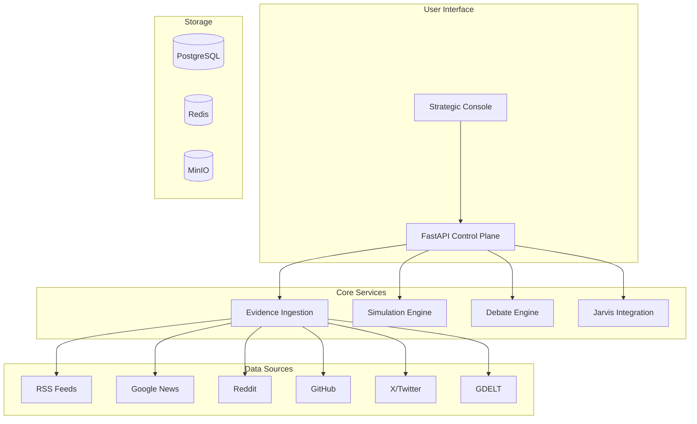

# 明鉴 (MingJian)

**AI-Powered Multi-Agent Platform for Evidence-Driven Scenario Simulation & Strategic Decision-Making**

**AI驱动的多代理平台 | 证据驱动的场景模拟与战略决策**

[](https://opensource.org/licenses/MIT)
[](https://www.python.org/downloads/)
[](https://fastapi.tiangolo.com/)
[](https://github.com/dashitongzhi/mingjian/stargazers)


---

## 🌟 Why 明鉴? / 为什么选择明鉴？

### 🔬 Evidence-Driven, Not Guess-Driven / 证据驱动，非猜测驱动

Unlike traditional simulation platforms that rely on assumptions, 明鉴 grounds every decision in **real-world evidence** from 10+ data sources (Google News, Reddit, GitHub, X/Twitter, GDELT, RSS feeds, weather, aviation data). Every claim is traceable, every decision is auditable.

与传统模拟平台不同，明鉴的每个决策都基于来自**10+数据源的真实证据**（Google News、Reddit、GitHub、X/Twitter、GDELT、RSS订阅、天气、航空数据）。每个声明可追溯，每个决策可审计。

### 🤖 Multi-Agent Debate Protocol / 多代理辩论协议

Critical decisions undergo **rigorous multi-agent debate** — multiple AI models (GPT, Gemini, Claude, Grok) argue different perspectives, challenge assumptions, and reach evidence-backed conclusions. This isn't just multi-model; it's **adversarial reasoning** for decision validation.

关键决策经过**严格的多代理辩论** — 多个AI模型（GPT、Gemini、Claude、Grok）从不同角度论证、挑战假设、达成有证据支持的结论。这不是简单的多模型，而是用于决策验证的**对抗性推理**。

### 🎯 Dual-Domain Expertise / 双领域专业能力

One platform, two domains: **Corporate** (market analysis, competitive intelligence, investment research) and **Military** (operational planning, logistics optimization, threat assessment). Shared infrastructure, domain-specific rules.

一个平台，两个领域：**企业**（市场分析、竞争情报、投资研究）和**军事**（作战规划、物流优化、威胁评估）。共享基础设施，领域特定规则。

### 🔍 Full Auditability with Decision Traces / 完全可审计的决策追踪

Every simulation produces a **deterministic decision trace** — a step-by-step record of how the AI reached its conclusion. No black boxes. Full transparency for compliance, review, and learning.

每个模拟产生**确定性决策追踪** — AI如何得出结论的逐步记录。没有黑箱。完全透明，用于合规、审查和学习。

### 🛡️ Jarvis Self-Repair Engine / Jarvis自我修复引擎

Integrated AI runtime for **self-review, cross-review, and automatic repair**. The system reviews its own outputs, identifies weaknesses, and iterates until quality thresholds are met — all without human intervention.

集成的AI运行时，用于**自我审查、交叉审查和自动修复**。系统审查自己的输出，识别弱点，并迭代直到达到质量阈值 — 全程无需人工干预。

### ⚡ Real-Time Streaming Analysis / 实时流式分析

Submit an analysis request and watch the AI work in real-time — streaming progress events, source attribution, and intermediate results. No waiting for black-box completion.

提交分析请求，实时观看AI工作 — 流式进度事件、来源归属和中间结果。无需等待黑箱完成。

---

## 🆚 Comparison with Other Projects / 与其他项目的对比

### 详细对比 / Detailed Comparison

| Feature / 特性 | 明鉴 | Traditional Simulation | Single-Agent AI | LangChain/AutoGen |
|----------------|------|------------------------|-----------------|-------------------|
| **Data Sources / 数据源** | ✅ 10+ real-time sources | ❌ Manual input only | ⚠️ Limited | ⚠️ Limited |
| **Evidence Chain / 证据链** | ✅ Full traceability | ❌ No tracking | ❌ No tracking | ❌ No tracking |
| **Multi-Agent Debate / 多代理辩论** | ✅ Adversarial reasoning | ❌ Single model | ❌ Single model | ⚠️ Basic multi-agent |
| **Decision Traces / 决策追踪** | ✅ Deterministic & auditable | ❌ Black box | ❌ Black box | ❌ Black box |
| **Self-Repair / 自我修复** | ✅ Jarvis engine | ❌ None | ❌ None | ❌ None |
| **Streaming Analysis / 流式分析** | ✅ Real-time events | ❌ Batch only | ❌ Batch only | ⚠️ Limited |
| **Corporate Domain / 企业领域** | ✅ Full support | ⚠️ Generic | ❌ Generic | ❌ Generic |
| **Military Domain / 军事领域** | ✅ Full support | ⚠️ Generic | ❌ Generic | ❌ Generic |
| **Scenario Branching / 场景分支** | ✅ Beam-search | ❌ Manual | ❌ None | ❌ None |
| **Knowledge Graph / 知识图谱** | ✅ Embedding-backed | ❌ None | ❌ None | ❌ None |
| **Strategic Console / 战略控制台** | ✅ Full web UI | ⚠️ Basic | ❌ CLI only | ❌ CLI only |
| **Debate Protocol / 辩论协议** | ✅ Advocate + Challenger + Arbitrator | ❌ None | ❌ None | ⚠️ Basic |
| **Source Health Monitoring / 来源健康监控** | ✅ Automated | ❌ Manual | ❌ None | ❌ None |
| **Docker Deployment / Docker部署** | ✅ One-click | ⚠️ Manual | ❌ None | ⚠️ Manual |
| **Open Source / 开源** | ✅ MIT License | ⚠️ Varies | ⚠️ Varies | ✅ Various |

### 核心优势总结 / Key Advantages Summary

```
明鉴 vs Others:

证据驱动     ✅ vs ❌    不是猜测，是真实数据
多代理辩论   ✅ vs ❌    AI之间互相挑战验证
决策追踪     ✅ vs ❌    每一步都可审计
自我修复     ✅ vs ❌    系统自动审查改进
双领域支持   ✅ vs ❌    企业+军事全覆盖
实时流式     ✅ vs ❌    不用等待黑箱完成
知识图谱     ✅ vs ❌    语义搜索和关联
场景分支     ✅ vs ❌    多路径模拟对比
```

### 适用场景对比 / Use Case Comparison

| 场景 / Scenario | 明鉴 | Others |
|-----------------|------|--------|
| 投资决策前的市场调研 | ✅ 自动采集+分析+辩论 | ❌ 手动搜索+单模型总结 |
| 军事后勤规划 | ✅ 多源情报+实时模拟 | ❌ 静态分析+人工判断 |
| 竞争对手分析 | ✅ 10+来源+知识图谱 | ⚠️ 单一来源+简单分析 |
| 风险评估 | ✅ 多模型辩论+审计追踪 | ❌ 单模型+无追踪 |
| 战略规划 | ✅ 场景分支+KPI对比 | ❌ 单一方案+主观评估 |

---

明鉴 is an AI-powered multi-agent platform that enables evidence-driven scenario simulation and strategic decision-making for both corporate and military domains. It features a debate protocol, real-time evidence ingestion, and advanced simulation capabilities.

## 🚀 Key Features

- **Evidence-Driven Intelligence**: Automatically ingest and analyze data from multiple sources (RSS, news, Reddit, GitHub, X, GDELT)
- **Multi-Domain Simulation**: Support for both corporate and military scenario modeling
- **AI Debate Protocol**: Multi-agent debate system for rigorous decision validation
- **Real-Time Analysis**: Streaming analysis with progress tracking and source attribution
- **Strategic Console**: Unified workbench for evidence review, scenario comparison, and decision tracing
- **Extensible Architecture**: Plugin-based design with YAML-configurable rules and models

## 💡 Why Choose 明鉴?

### **1. Evidence-Based Decision Making**
Unlike traditional simulation platforms, 明鉴 grounds every decision in real-world evidence. The system automatically ingests data from 10+ sources, validates claims, and maintains a complete evidence chain for auditability.

### **2. Multi-Agent Debate Protocol**
Critical decisions undergo rigorous multi-agent debate, ensuring:
- **Diverse perspectives** from different AI models
- **Evidence-backed arguments** with source attribution
- **Transparent reasoning** with complete audit trails
- **Conflict resolution** through structured debate protocols

### **3. Dual-Domain Expertise**
明鉴 supports both corporate and military domains with:
- **Corporate**: Market analysis, competitive intelligence, investment research
- **Military**: Operational planning, logistics optimization, threat assessment
- **Shared**: Risk management, scenario planning, strategic foresight

### **4. Production-Ready Architecture**
Built with enterprise-grade technologies:
- **FastAPI** for high-performance async APIs
- **SQLAlchemy** for robust database operations
- **Redis Streams** for scalable event processing
- **pgvector** for AI-powered similarity search
- **Docker Compose** for easy deployment

### **5. Extensible & Customizable**
- **YAML-based configuration** for rules and models
- **Plugin architecture** for custom data sources
- **API-first design** for integration with existing systems
- **Open-source** with MIT license for maximum flexibility

## 🎯 Use Cases

- **Corporate Strategy**: Market analysis, competitive intelligence, and scenario planning
- **Military Planning**: Operational analysis, logistics simulation, and threat assessment
- **Risk Management**: Evidence-based risk assessment with multi-perspective validation
- **Investment Research**: Data-driven investment thesis development and stress testing

## 📦 Quick Start

### Prerequisites

- Python 3.12+
- Node.js 18+ (for frontend)
- PostgreSQL (optional, SQLite for development)
- Redis (optional, for event bus)

### Installation

```bash
# Clone the repository
git clone https://github.com/dashitongzhi/mingjian.git
cd mingjian

# Backend setup
python -m venv .venv
source .venv/bin/activate  # On Windows: .venv\Scripts\activate
pip install -e ".[dev]"

# Frontend setup
cd frontend
npm install
cd ..
```

### Configuration

```bash
# Copy example configuration
cp .env.example .env

# Configure your environment variables
# Required: PLANAGENT_OPENAI_API_KEY for AI features
# Optional: PostgreSQL, Redis, and other service connections
```

### Run the Application

**Backend (FastAPI):**
```bash
uvicorn planagent.main:app --reload
```

**Frontend (Next.js):**
```bash
cd frontend
npm run dev
# Open http://localhost:3000
```

**Production Build:**
```bash
cd frontend
npm run build
npm start
# Or use Docker
docker build -t mingjian-frontend .
docker run -p 3000:3000 mingjian-frontend
```

**Alternative Packaging Options:**
```bash
# Standalone build (default)
npm run package:standalone

# Static export (for CDN deployment)
npm run package:static

# Docker build
npm run package:docker

# Preview production build
npm run preview
```

### Submit Your First Analysis

```bash
# Corporate analysis
curl -X POST http://127.0.0.1:8000/analysis \
  -H "Content-Type: application/json" \
  -d '{
    "content": "Analyze recent developments in AI chip manufacturing",
    "domain_id": "corporate",
    "auto_fetch_news": true,
    "include_google_news": true,
    "include_reddit": true,
    "include_hacker_news": true
  }'

# Military analysis
curl -X POST http://127.0.0.1:8000/analysis/stream \
  -H "Content-Type: application/json" \
  -d '{
    "content": "Assess logistics challenges in eastern theater operations",
    "domain_id": "military",
    "auto_fetch_news": true
  }'
```

## 🏗️ Architecture



## 📁 Project Structure

```
├── src/planagent/           # Python backend
│   ├── api/                 # FastAPI routes and dependencies
│   ├── core/                # Database, configuration, logging
│   ├── models/              # SQLAlchemy ORM models
│   ├── services/            # Business logic services
│   ├── engine/              # Simulation engine and actions
│   ├── rules/               # YAML-based rule definitions
│   └── worker/              # Background task processing
├── frontend/                # Next.js frontend
│   ├── src/app/             # React pages and components
│   ├── src/lib/             # API client and utilities
│   └── public/              # Static assets
├── migrations/              # Alembic database migrations
├── evidence/                # Evidence-related modules
├── minio/                   # Object storage integration
├── postgres/                # PostgreSQL configuration
└── scripts/                 # Utility scripts
```

## 🧪 Testing

```bash
# Run all tests
pytest

# Run with coverage
pytest --cov=planagent

# Run specific test file
pytest tests/test_debate.py

# Run with verbose output
pytest -v
```

## 📚 Documentation

- [Full Technical Report](docs/planagent_full_report.md)
- [Agent Startup Playbook](docs/agent_startup_playbook.md)
- [Technical Debt Backlog](TECHNICAL_DEBT_BACKLOG.md)
- [Contributing Guide](CONTRIBUTING.md)
- [Changelog](CHANGELOG.md)

## 🤝 Contributing

We welcome contributions! Please see our [Contributing Guide](CONTRIBUTING.md) for details.

```bash
# Fork the repository
# Create a feature branch
git checkout -b feature/amazing-feature

# Make your changes
# Run tests
pytest

# Commit your changes
git commit -m "feat: add amazing feature"

# Push to the branch
git push origin feature/amazing-feature

# Open a Pull Request
```

## 📄 License

This project is licensed under the MIT License - see the [LICENSE](LICENSE) file for details.

## 🙏 Acknowledgments

- Built with [FastAPI](https://fastapi.tiangolo.com/)
- Frontend powered by [Next.js](https://nextjs.org/)
- Database: [PostgreSQL](https://www.postgresql.org/) with [pgvector](https://github.com/pgvector/pgvector)
- Event streaming: [Redis Streams](https://redis.io/docs/data-types/streams/)
- Object storage: [MinIO](https://min.io/)

## 📞 Support

- 📧 Email: [Your Email]
- 🐛 Issues: [GitHub Issues](https://github.com/dashitongzhi/mingjian/issues)
- 💬 Discussions: [GitHub Discussions](https://github.com/dashitongzhi/mingjian/discussions)

---

**明鉴** — *明察秋毫，鉴往知来*

**明鉴** — *See Clearly, Judge Wisely*
