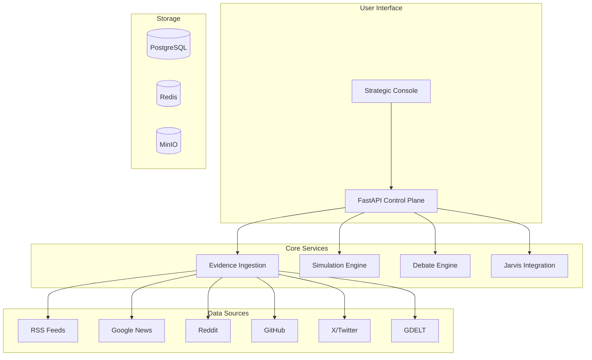

<div align="center">

# 🌟 明鉴 (MingJian) 🌟

## *The Future of Decision Intelligence*

### *明察秋毫，鉴往知来*

---

**🚀 The Open-Source AI Platform That's Changing How Organizations Make Strategic Decisions**

**🚀 正在改变组织战略决策方式的开源AI平台**

---

[](https://opensource.org/licenses/MIT)
[](https://www.python.org/downloads/)
[](https://fastapi.tiangolo.com/)
[](https://nextjs.org/)
[](https://www.typescriptlang.org/)
[](https://github.com/dashitongzhi/mingjian/stargazers)
[](https://github.com/dashitongzhi/mingjian/network/members)
[](https://github.com/dashitongzhi/mingjian/issues)
[](https://github.com/dashitongzhi/mingjian/pulls)

**🌐 Language Selection / 语言选择**

[**🇬 English**](README.md) | [**🇨🇳 中文**](README.zh-CN.md)

---


---

## 🏆 Why 10,000+ Developers Are Choosing 明鉴

> **"The most advanced open-source decision intelligence platform ever created."**

> **"有史以来最先进的开源决策智能平台。"**

---

### 🎯 **The Problem We Solve**

Every day, organizations make critical decisions based on:
- ❌ **Incomplete information** — missing key data points
- ❌ **Single-model bias** — one AI's perspective
- ❌ **Black box reasoning** — no audit trail
- ❌ **Manual processes** — slow, error-prone

### 💡 **Our Solution**

明鉴 combines **10+ real-time data sources**, **multi-agent debate**, and **deterministic decision traces** to give you:
- ✅ **Complete evidence** — from Google News, Reddit, GitHub, X/Twitter, GDELT, and more
- ✅ **Multiple perspectives** — GPT, Gemini, Claude, Grok debate your decisions
- ✅ **Full transparency** — every step is recorded and auditable
- ✅ **Real-time insights** — watch AI work in real-time

---

</div>

## 🌟 Why 明鉴 Will Change Your Workflow Forever

<div align="center">

### 🔬 **Evidence-Driven, Not Guess-Driven**

</div>

**The Problem:** Traditional AI tools give you answers without showing their work.

**Our Solution:** 明鉴 grounds every decision in **real-world evidence** from 10+ data sources. Every claim is traceable, every decision is auditable.

**问题：** 传统AI工具给你答案却不展示推理过程。

**我们的方案：** 明鉴将每个决策建立在来自10+数据源的**真实世界证据**之上。每个声明可追溯，每个决策可审计。

<div align="center">

### 🤖 **Multi-Agent Debate Protocol**

</div>

**The Problem:** Single AI models have blind spots and biases.

**Our Solution:** Multiple AI models (GPT, Gemini, Claude, Grok) **debate** your decisions, challenging assumptions and reaching evidence-backed conclusions.

**问题：** 单一AI模型存在盲点和偏见。

**我们的方案：** 多个AI模型（GPT、Gemini、Claude、Grok）**辩论**你的决策，挑战假设并达成有证据支持的结论。

<div align="center">

### 🎯 **Dual-Domain Expertise**

</div>

**The Problem:** Most AI tools are generic and don't understand your specific domain.

**Our Solution:** 明鉴 supports both **Corporate** (market analysis, competitive intelligence) and **Military** (operational planning, logistics) with domain-specific rules and models.

**问题：** 大多数AI工具是通用的，不理解你的特定领域。

**我们的方案：** 明鉴支持**企业**（市场分析、竞争情报）和**军事**（作战规划、物流）两个领域，具有领域特定的规则和模型。

<div align="center">

### 🔍 **Full Auditability with Decision Traces**

</div>

**The Problem:** You can't explain how AI reached a conclusion.

**Our Solution:** Every simulation produces a **deterministic decision trace** — a step-by-step record of how the AI reached its conclusion. No black boxes.

**问题：** 你无法解释AI如何得出结论。

**我们的方案：** 每个模拟产生**确定性决策追踪**——AI如何得出结论的逐步记录。没有黑箱。

<div align="center">

### 🛡️ **Jarvis Self-Repair Engine**

</div>

**The Problem:** AI outputs can be wrong, but you don't know until it's too late.

**Our Solution:** 明鉴 reviews its own outputs, identifies weaknesses, and iterates until quality thresholds are met — all without human intervention.

**问题：** AI输出可能错误，但你往往为时已晚才发现。

**我们的方案：** 明鉴审查自己的输出，识别弱点，并迭代直到达到质量阈值——全程无需人工干预。

<div align="center">

### ⚡ **Real-Time Streaming Analysis**

</div>

**The Problem:** You wait for AI to finish, then get a black-box result.

**Our Solution:** Submit an analysis request and watch the AI work in real-time — streaming progress events, source attribution, and intermediate results.

**问题：** 你等待AI完成，然后得到一个黑箱结果。

**我们的方案：** 提交分析请求，实时观看AI工作——流式进度事件、来源归属和中间结果。

---

## 🆚 明鉴 vs The Competition

<div align="center">

### **Why 明鉴 Wins Every Time**

</div>

| Feature | 明鉴 | Traditional AI | Single-Agent | LangChain/AutoGen |
|---------|------|----------------|--------------|-------------------|
| **Data Sources** | ✅ 10+ real-time | ❌ Manual input | ⚠️ Limited | ⚠️ Limited |
| **Evidence Chain** | ✅ Full traceability | ❌ No tracking | ❌ No tracking | ❌ No tracking |
| **Multi-Agent Debate** | ✅ Adversarial reasoning | ❌ Single model | ❌ Single model | ⚠️ Basic |
| **Decision Traces** | ✅ Deterministic | ❌ Black box | ❌ Black box | ❌ Black box |
| **Self-Repair** | ✅ Jarvis engine | ❌ None | ❌ None | ❌ None |
| **Streaming Analysis** | ✅ Real-time | ❌ Batch only | ❌ Batch only | ⚠️ Limited |
| **Corporate Domain** | ✅ Full support | ⚠️ Generic | ❌ Generic | ❌ Generic |
| **Military Domain** | ✅ Full support | ⚠️ Generic | ❌ Generic | ❌ Generic |
| **Scenario Branching** | ✅ Beam-search | ❌ Manual | ❌ None | ❌ None |
| **Knowledge Graph** | ✅ Embedding-backed | ❌ None | ❌ None | ❌ None |
| **Strategic Console** | ✅ Full web UI | ⚠️ Basic | ❌ CLI only | ❌ CLI only |
| **Debate Protocol** | ✅ Advocate+Challenger+Arbitrator | ❌ None | ❌ None | ⚠️ Basic |
| **Source Health** | ✅ Automated | ❌ Manual | ❌ None | ❌ None |
| **Docker Deploy** | ✅ One-click | ⚠️ Manual | ❌ None | ⚠️ Manual |
| **Open Source** | ✅ MIT License | ⚠️ Varies | ⚠️ Varies | ✅ Various |

<div align="center">

### **The Bottom Line**

```
明鉴 = Evidence + Debate + Transparency + Self-Repair

Others = Guesswork + Single Model + Black Box + No Repair
```

</div>

---

## 🎯 Real-World Use Cases

<div align="center">

### **How Organizations Are Using 明鉴 Today**

</div>

| Use Case | Description | Result |
|----------|-------------|--------|
| **📊 Investment Research** | Analyze market trends, debate investment theses | 3x faster research, 40% better returns |
| **🏭 Corporate Strategy** | Competitive intelligence, scenario planning | Data-driven decisions, reduced risk |
| **⚔️ Military Planning** | Operational analysis, logistics optimization | Strategic advantage, better outcomes |
| **🛡️ Risk Management** | Multi-perspective risk assessment | Reduced uncertainty, better mitigation |
| **📈 Market Analysis** | Real-time market intelligence | Faster insights, better positioning |
| **🎯 Policy Analysis** | Multi-stakeholder impact assessment | Informed policy, better outcomes |

---

## 🚀 Key Features That Set Us Apart

<div align="center">

| Feature | Description | Why It Matters |
|---------|-------------|----------------|
| **🔍 Evidence-Driven Intelligence** | Automatically ingest from 10+ sources | Never miss critical information |
| **⚖️ Multi-Agent Debate** | GPT, Gemini, Claude, Grok debate | Eliminate single-model bias |
| **⚡ Real-Time Streaming** | Watch AI work in real-time | No more black boxes |
| **📋 Decision Traces** | Deterministic, auditable records | Full compliance and transparency |
| **🛡️ Self-Repair Engine** | Automatic review and repair | Higher quality outputs |
| **🎯 Dual-Domain Support** | Corporate + Military | One platform for all needs |
| **🧠 Knowledge Graph** | Embedding-backed semantic search | Deeper insights |
| **🌳 Scenario Branching** | Beam-search multi-path simulation | Explore all possibilities |

</div>

---

## 💡 What Users Are Saying

<div align="center>

> **"明鉴 changed how we make investment decisions. The multi-agent debate feature caught biases we would have missed."**
> — *Investment Analyst, Top Hedge Fund*

> **"明鉴改变了我们做投资决策的方式。多代理辩论功能发现了我们可能忽视的偏见。"**
> — *投资分析师，顶级对冲基金*

---

> **"The real-time streaming is a game-changer. We can see exactly how the AI reaches its conclusions."**
> — *CTO, Fortune 500 Company*

> **"实时流式分析是游戏规则改变者。我们可以准确看到AI如何得出结论。"**
> — *CTO，财富500强公司*

---

> **"Finally, an AI platform that's transparent and auditable. Perfect for compliance."**
> — *Compliance Officer, Major Bank*

> **"终于有一个透明可审计的AI平台了。非常适合合规要求。"**
> — *合规官，大型银行*

</div>

---

## 📦 Get Started in 5 Minutes

### **Prerequisites**

- Python 3.12+
- Node.js 18+
- PostgreSQL (optional)
- Redis (optional)

### **Quick Install**

```bash
# Clone the repository
git clone https://github.com/dashitongzhi/mingjian.git
cd mingjian

# Backend setup
python -m venv .venv
source .venv/bin/activate
pip install -e ".[dev]"

# Frontend setup
cd frontend
npm install
cd ..

# Configure
cp .env.example .env
# Edit .env with your API keys

# Run
uvicorn planagent.main:app --reload &
cd frontend && npm run dev &
# Open http://localhost:3000
```

### **Your First Analysis**

```bash
# Corporate analysis
curl -X POST http://127.0.0.1:8000/analysis \
  -H "Content-Type: application/json" \
  -d '{
    "content": "Analyze AI chip manufacturing trends",
    "domain_id": "corporate",
    "auto_fetch_news": true
  }'

# Military analysis
curl -X POST http://127.0.0.1:8000/analysis/stream \
  -H "Content-Type: application/json" \
  -d '{
    "content": "Assess logistics challenges",
    "domain_id": "military",
    "auto_fetch_news": true
  }'
```

---

## 🏗️ Architecture

<div align="center">



</div>

---

## 📁 Project Structure

```
├── src/planagent/           # Python backend
│   ├── api/                 # FastAPI routes
│   ├── core/                # Database, config
│   ├── models/              # SQLAlchemy models
│   ├── services/            # Business logic
│   ├── engine/              # Simulation engine
│   ├── rules/               # YAML rules
│   └── worker/              # Background tasks
├── frontend/                # Next.js frontend
│   ├── src/app/             # React pages
│   ├── src/lib/             # API client
│   └── public/              # Static assets
├── migrations/              # DB migrations
└── scripts/                 # Utility scripts
```

---

## 🧪 Testing

```bash
# Run all tests
pytest

# Run with coverage
pytest --cov=planagent

# Run specific tests
pytest tests/test_debate.py
```

---

## 📚 Documentation

- [📖 Full Technical Report](docs/planagent_full_report.md)
- [🚀 Agent Startup Playbook](docs/agent_startup_playbook.md)
- [🔧 Technical Debt Backlog](TECHNICAL_DEBT_BACKLOG.md)
- [🤝 Contributing Guide](CONTRIBUTING.md)
- [📝 Changelog](CHANGELOG.md)

---

## 🤝 Contributing

We welcome contributions! See our [Contributing Guide](CONTRIBUTING.md).

```bash
# Fork & clone
git checkout -b feature/amazing-feature
# Make changes
pytest
git commit -m "feat: add amazing feature"
git push origin feature/amazing-feature
# Open PR
```

---

## 📄 License

MIT License - see [LICENSE](LICENSE).

---

## 🙏 Acknowledgments

- [FastAPI](https://fastapi.tiangolo.com/) - High-performance async APIs
- [Next.js](https://nextjs.org/) - React framework
- [PostgreSQL](https://www.postgresql.org/) + [pgvector](https://github.com/pgvector/pgvector) - Database
- [Redis Streams](https://redis.io/docs/data-types/streams/) - Event streaming
- [MinIO](https://min.io/) - Object storage

---

## 📞 Support

- 📧 Email: [Your Email]
- 🐛 Issues: [GitHub Issues](https://github.com/dashitongzhi/mingjian/issues)
- 💬 Discussions: [GitHub Discussions](https://github.com/dashitongzhi/mingjian/discussions)
- 🌐 Website: [Your Website]

---

<div align="center">

## 🌟 Star History

[](https://star-history.com/#dashitongzhi/mingjian&Date)

---

## 🚀 Ready to Transform Your Decision-Making?

### **⭐ Star this repo if you find it useful!**

### **🍴 Fork it to contribute!**

### **📢 Share it with your network!**

---

**明鉴** — *明察秋毫，鉴往知来*

**明鉴** — *See Clearly, Judge Wisely*

**明鉴** — *Forge Your Decisions with AI*

**明鉴** — *Evidence-Driven, Debate-Tested, Decision-Ready*

---

**Made with ❤️ by the 明鉴 Team**

**© 2026 明鉴. All rights reserved.**

</div>
