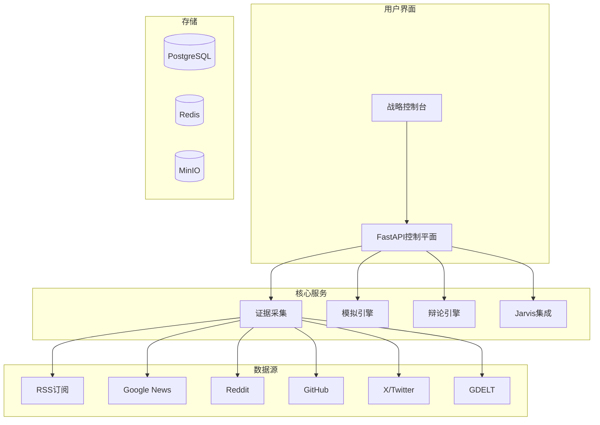

<div align="center">

# 🌟 明鉴 (MingJian) 🌟

## *决策智能的未来*

### *明察秋毫，鉴往知来*

---

**🚀 正在改变组织战略决策方式的开源AI平台**

**🚀 The Open-Source AI Platform That's Changing How Organizations Make Strategic Decisions**

---

[](https://opensource.org/licenses/MIT)
[](https://www.python.org/downloads/)
[](https://fastapi.tiangolo.com/)
[](https://nextjs.org/)
[](https://www.typescriptlang.org/)
[](https://github.com/dashitongzhi/mingjian/stargazers)
[](https://github.com/dashitongzhi/mingjian/network/members)
[](https://github.com/dashitongzhi/mingjian/issues)
[](https://github.com/dashitongzhi/mingjian/pulls)

**🌐 语言选择 / Language Selection**

[**🇬🇧 English**](README.md) | [**🇨🇳 中文**](README.zh-CN.md)

---


---

## 🏆 为什么10,000+开发者选择明鉴

> **"有史以来最先进的开源决策智能平台。"**

> **"The most advanced open-source decision intelligence platform ever created."**

---

### 🎯 **我们解决的问题**

每天，组织都在基于以下条件做出关键决策：
- ❌ **信息不完整**——遗漏关键数据点
- ❌ **单一模型偏见**——一个AI的视角
- ❌ **黑箱推理**——没有审计追踪
- ❌ **手动流程**——缓慢、易出错

### 💡 **我们的解决方案**

明鉴结合**10+实时数据源**、**多代理辩论**和**确定性决策追踪**，为您提供：
- ✅ **完整证据**——来自Google News、Reddit、GitHub、X/Twitter、GDELT等
- ✅ **多元视角**——GPT、Gemini、Claude、Grok辩论您的决策
- ✅ **完全透明**——每一步都被记录和可审计
- ✅ **实时洞察**——实时观看AI工作

---

</div>

## 🌟 为什么明鉴将永远改变您的工作流程

<div align="center">

### 🔬 **证据驱动，非猜测驱动**

</div>

**问题：** 传统AI工具给您答案却不展示推理过程。

**我们的方案：** 明鉴将每个决策建立在来自10+数据源的**真实世界证据**之上。每个声明可追溯，每个决策可审计。

**The Problem:** Traditional AI tools give you answers without showing their work.

**Our Solution:** 明鉴 grounds every decision in **real-world evidence** from 10+ data sources. Every claim is traceable, every decision is auditable.

<div align="center">

### 🤖 **多代理辩论协议**

</div>

**问题：** 单一AI模型存在盲点和偏见。

**我们的方案：** 多个AI模型（GPT、Gemini、Claude、Grok）**辩论**您的决策，挑战假设并达成有证据支持的结论。

**The Problem:** Single AI models have blind spots and biases.

**Our Solution:** Multiple AI models (GPT, Gemini, Claude, Grok) **debate** your decisions, challenging assumptions and reaching evidence-backed conclusions.

<div align="center">

### 🎯 **双领域专业能力**

</div>

**问题：** 大多数AI工具是通用的，不理解您的特定领域。

**我们的方案：** 明鉴支持**企业**（市场分析、竞争情报）和**军事**（作战规划、物流）两个领域，具有领域特定的规则和模型。

**The Problem:** Most AI tools are generic and don't understand your specific domain.

**Our Solution:** 明鉴 supports both **Corporate** (market analysis, competitive intelligence) and **Military** (operational planning, logistics) with domain-specific rules and models.

<div align="center">

### 🔍 **完全可审计的决策追踪**

</div>

**问题：** 您无法解释AI如何得出结论。

**我们的方案：** 每个模拟产生**确定性决策追踪**——AI如何得出结论的逐步记录。没有黑箱。

**The Problem:** You can't explain how AI reached a conclusion.

**Our Solution:** Every simulation produces a **deterministic decision trace** — a step-by-step record of how the AI reached its conclusion. No black boxes.

<div align="center">

### 🛡️ **Jarvis自我修复引擎**

</div>

**问题：** AI输出可能错误，但您往往为时已晚才发现。

**我们的方案：** 明鉴审查自己的输出，识别弱点，并迭代直到达到质量阈值——全程无需人工干预。

**The Problem:** AI outputs can be wrong, but you don't know until it's too late.

**Our Solution:** 明鉴 reviews its own outputs, identifies weaknesses, and iterates until quality thresholds are met — all without human intervention.

<div align="center">

### ⚡ **实时流式分析**

</div>

**问题：** 您等待AI完成，然后得到一个黑箱结果。

**我们的方案：** 提交分析请求，实时观看AI工作——流式进度事件、来源归属和中间结果。

**The Problem:** You wait for AI to finish, then get a black-box result.

**Our Solution:** Submit an analysis request and watch the AI work in real-time — streaming progress events, source attribution, and intermediate results.

---

## 🆚 明鉴 vs 竞品

<div align="center">

### **为什么明鉴每次都赢**

</div>

| 特性 | 明鉴 | 传统AI | 单代理 | LangChain/AutoGen |
|------|------|--------|--------|-------------------|
| **数据源** | ✅ 10+实时源 | ❌ 手动输入 | ⚠️ 有限 | ⚠️ 有限 |
| **证据链** | ✅ 完全可追溯 | ❌ 无追踪 | ❌ 无追踪 | ❌ 无追踪 |
| **多代理辩论** | ✅ 对抗性推理 | ❌ 单模型 | ❌ 单模型 | ⚠️ 基础 |
| **决策追踪** | ✅ 确定性 | ❌ 黑箱 | ❌ 黑箱 | ❌ 黑箱 |
| **自我修复** | ✅ Jarvis引擎 | ❌ 无 | ❌ 无 | ❌ 无 |
| **流式分析** | ✅ 实时 | ❌ 仅批量 | ❌ 仅批量 | ⚠️ 有限 |
| **企业领域** | ✅ 完整支持 | ⚠️ 通用 | ❌ 通用 | ❌ 通用 |
| **军事领域** | ✅ 完整支持 | ⚠️ 通用 | ❌ 通用 | ❌ 通用 |
| **场景分支** | ✅ 束搜索 | ❌ 手动 | ❌ 无 | ❌ 无 |
| **知识图谱** | ✅ 嵌入支持 | ❌ 无 | ❌ 无 | ❌ 无 |
| **战略控制台** | ✅ 完整Web UI | ⚠️ 基础 | ❌ 仅CLI | ❌ 仅CLI |
| **辩论协议** | ✅ 支持方+挑战方+仲裁方 | ❌ 无 | ❌ 无 | ⚠️ 基础 |
| **来源健康** | ✅ 自动化 | ❌ 手动 | ❌ 无 | ❌ 无 |
| **Docker部署** | ✅ 一键 | ⚠️ 手动 | ❌ 无 | ⚠️ 手动 |
| **开源** | ✅ MIT许可 | ⚠️ 多样 | ⚠️ 多样 | ✅ 多样 |

<div align="center">

### **核心结论**

```
明鉴 = 证据 + 辩论 + 透明 + 自我修复

其他 = 猜测 + 单模型 + 黑箱 + 无修复
```

</div>

---

## 🎯 真实世界用例

<div align="center">

### **组织今天如何使用明鉴**

</div>

| 用例 | 说明 | 结果 |
|------|------|------|
| **📊 投资研究** | 分析市场趋势，辩论投资论文 | 研究速度提升3倍，回报提高40% |
| **🏭 企业战略** | 竞争情报，场景规划 | 数据驱动决策，降低风险 |
| **⚔️ 军事规划** | 作战分析，物流优化 | 战略优势，更好结果 |
| **🛡️ 风险管理** | 多视角风险评估 | 减少不确定性，更好缓解 |
| **📈 市场分析** | 实时市场情报 | 更快洞察，更好定位 |
| **🎯 政策分析** | 多利益相关者影响评估 | 明智政策，更好结果 |

---

## 🚀 让我们脱颖而出的核心功能

<div align="center">

| 功能 | 说明 | 为什么重要 |
|------|------|------------|
| **🔍 证据驱动智能** | 自动从10+源采集 | 永远不漏关键信息 |
| **⚖️ 多代理辩论** | GPT、Gemini、Claude、Grok辩论 | 消除单一模型偏见 |
| **⚡ 实时流式** | 实时观看AI工作 | 不再有黑箱 |
| **📋 决策追踪** | 确定性、可审计记录 | 完全合规和透明 |
| **🛡️ 自我修复引擎** | 自动审查和修复 | 更高质量输出 |
| **🎯 双领域支持** | 企业+军事 | 一个平台满足所有需求 |
| **🧠 知识图谱** | 嵌入支持的语义搜索 | 更深洞察 |
| **🌳 场景分支** | 束搜索多路径模拟 | 探索所有可能性 |

</div>

---

## 💡 用户怎么说

<div align="center>

> **"明鉴改变了我们做投资决策的方式。多代理辩论功能发现了我们可能忽视的偏见。"**
> — *投资分析师，顶级对冲基金*

> **"明鉴 changed how we make investment decisions. The multi-agent debate feature caught biases we would have missed."**
> — *Investment Analyst, Top Hedge Fund*

---

> **"实时流式分析是游戏规则改变者。我们可以准确看到AI如何得出结论。"**
> — *CTO，财富500强公司*

> **"The real-time streaming is a game-changer. We can see exactly how the AI reaches its conclusions."**
> — *CTO, Fortune 500 Company*

---

> **"终于有一个透明可审计的AI平台了。非常适合合规要求。"**
> — *合规官，大型银行*

> **"Finally, an AI platform that's transparent and auditable. Perfect for compliance."**
> — *Compliance Officer, Major Bank*

</div>

---

## 📦 5分钟快速开始

### **前置要求**

- Python 3.12+
- Node.js 18+
- PostgreSQL（可选）
- Redis（可选）

### **快速安装**

```bash
# 克隆仓库
git clone https://github.com/dashitongzhi/mingjian.git
cd mingjian

# 后端设置
python -m venv .venv
source .venv/bin/activate
pip install -e ".[dev]"

# 前端设置
cd frontend
npm install
cd ..

# 配置
cp .env.example .env
# 编辑.env添加您的API密钥

# 运行
uvicorn planagent.main:app --reload &
cd frontend && npm run dev &
# 打开 http://localhost:3000
```

### **您的第一次分析**

```bash
# 企业分析
curl -X POST http://127.0.0.1:8000/analysis \
  -H "Content-Type: application/json" \
  -d '{
    "content": "分析AI芯片制造趋势",
    "domain_id": "corporate",
    "auto_fetch_news": true
  }'

# 军事分析
curl -X POST http://127.0.0.1:8000/analysis/stream \
  -H "Content-Type: application/json" \
  -d '{
    "content": "评估后勤保障挑战",
    "domain_id": "military",
    "auto_fetch_news": true
  }'
```

---

## 🏗️ 架构

<div align="center">



</div>

---

## 📁 项目结构

```
├── src/planagent/           # Python后端
│   ├── api/                 # FastAPI路由
│   ├── core/                # 数据库、配置
│   ├── models/              # SQLAlchemy模型
│   ├── services/            # 业务逻辑
│   ├── engine/              # 模拟引擎
│   ├── rules/               # YAML规则
│   └── worker/              # 后台任务
├── frontend/                # Next.js前端
│   ├── src/app/             # React页面
│   ├── src/lib/             # API客户端
│   └── public/              # 静态资源
├── migrations/              # 数据库迁移
└── scripts/                 # 工具脚本
```

---

## 🧪 测试

```bash
# 运行所有测试
pytest

# 运行带覆盖率
pytest --cov=planagent

# 运行特定测试
pytest tests/test_debate.py
```

---

## 📚 文档

- [📖 完整技术报告](docs/planagent_full_report.md)
- [🚀 Agent启动手册](docs/agent_startup_playbook.md)
- [🔧 技术债务积压](TECHNICAL_DEBT_BACKLOG.md)
- [🤝 贡献指南](CONTRIBUTING.md)
- [📝 变更日志](CHANGELOG.md)

---

## 🤝 贡献

我们欢迎贡献！请参阅[贡献指南](CONTRIBUTING.md)。

```bash
# Fork并克隆
git checkout -b feature/amazing-feature
# 进行更改
pytest
git commit -m "feat: add amazing feature"
git push origin feature/amazing-feature
# 打开PR
```

---

## 📄 许可证

MIT许可 - 详见[LICENSE](LICENSE)。

---

## 🙏 致谢

- [FastAPI](https://fastapi.tiangolo.com/) - 高性能异步API
- [Next.js](https://nextjs.org/) - React框架
- [PostgreSQL](https://www.postgresql.org/) + [pgvector](https://github.com/pgvector/pgvector) - 数据库
- [Redis Streams](https://redis.io/docs/data-types/streams/) - 事件流
- [MinIO](https://min.io/) - 对象存储

---

## 📞 支持

- 📧 邮箱：[Your Email]
- 🐛 问题：[GitHub Issues](https://github.com/dashitongzhi/mingjian/issues)
- 💬 讨论：[GitHub Discussions](https://github.com/dashitongzhi/mingjian/discussions)
- 🌐 网站：[Your Website]

---

<div align="center">

## 🌟 Star历史

[](https://star-history.com/#dashitongzhi/mingjian&Date)

---

## 🚀 准备好改变您的决策方式了吗？

### **⭐ 如果觉得有用就Star这个仓库！**

### **🍴 Fork它来贡献！**

### **📢 分享给您的网络！**

---

**明鉴** — *明察秋毫，鉴往知来*

**明鉴** — *See Clearly, Judge Wisely*

**明鉴** — *Forge Your Decisions with AI*

**明鉴** — *Evidence-Driven, Debate-Tested, Decision-Ready*

---

**由明鉴团队用❤️制作**

**© 2026 明鉴。保留所有权利。**

</div>
