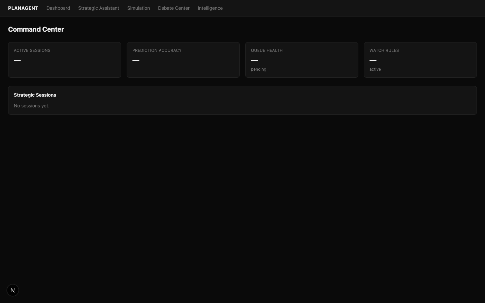
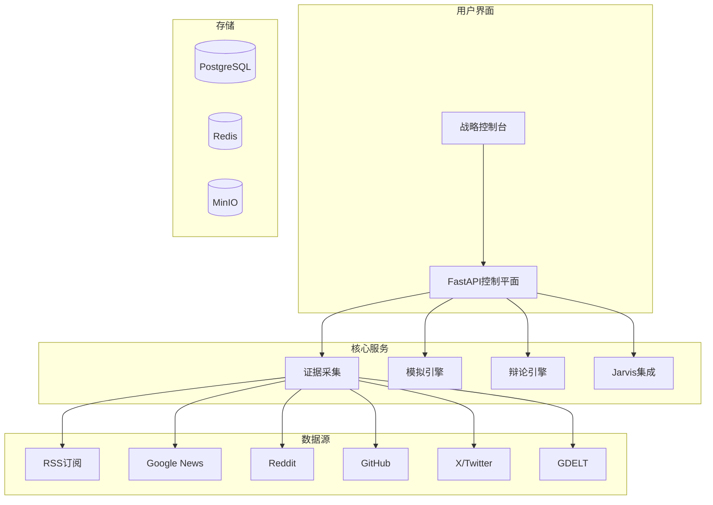

<div align="center">

# 明鉴 (MingJian)

### *明察秋毫，鉴往知来*

**AI驱动的多代理平台 | 证据驱动的场景模拟与战略决策**

---

[](https://opensource.org/licenses/MIT)
[](https://www.python.org/downloads/)
[](https://fastapi.tiangolo.com/)
[](https://nextjs.org/)
[](https://www.typescriptlang.org/)
[](https://github.com/dashitongzhi/planagent/stargazers)
[](https://github.com/dashitongzhi/planagent/network/members)

**🌐 语言选择 / Language Selection**

[**🇬🇧 English**](README.md) | [**🇨🇳 中文**](README.zh-CN.md)

---



</div>

---

## 🌟 为什么选择明鉴？

> **"第一个将证据驱动分析、多代理辩论和实时模拟统一在一个工作空间中的开源平台。"**

明鉴不仅仅是一个AI工具——它是组织进行战略决策方式的**范式转变**。通过结合10+实时数据源、对抗性多代理辩论和确定性决策追踪，明鉴消除了困扰传统AI系统的"黑箱"问题。

---

## 🎯 我们解决的问题

每天，组织都在基于以下条件做出关键决策：

- ❌ **信息不完整**——遗漏关键数据点
- ❌ **单一模型偏见**——一个AI的视角
- ❌ **黑箱推理**——没有审计追踪
- ❌ **手动流程**——缓慢、易出错

## 💡 我们的解决方案

明鉴结合**10+实时数据源**、**多代理辩论**和**确定性决策追踪**，为您提供：

- ✅ **完整证据**——来自Google News、Reddit、GitHub、X/Twitter、GDELT等
- ✅ **多元视角**——GPT、Gemini、Claude、Grok辩论您的决策
- ✅ **完全透明**——每一步都被记录和可审计
- ✅ **实时洞察**——实时观看AI工作

---

## 🔬 核心功能

### 1. 证据驱动，非猜测驱动

**问题：** 传统AI工具给您答案却不展示推理过程。

**我们的方案：** 明鉴将每个决策建立在来自10+数据源的**真实世界证据**之上。每个声明可追溯，每个决策可审计。

### 2. 多代理辩论协议

**问题：** 单一AI模型存在盲点和偏见。

**我们的方案：** 多个AI模型（GPT、Gemini、Claude、Grok）**辩论**您的决策，挑战假设并达成有证据支持的结论。

### 3. 双领域专业能力

**问题：** 大多数AI工具是通用的，不理解您的特定领域。

**我们的方案：** 明鉴支持**企业**（市场分析、竞争情报）和**军事**（作战规划、物流）两个领域，具有领域特定的规则和模型。

### 4. 完全可审计的决策追踪

**问题：** 您无法解释AI如何得出结论。

**我们的方案：** 每个模拟产生**确定性决策追踪**——AI如何得出结论的逐步记录。没有黑箱。

### 5. Jarvis自我修复引擎

**问题：** AI输出可能错误，但您往往为时已晚才发现。

**我们的方案：** 明鉴审查自己的输出，识别弱点，并迭代直到达到质量阈值——全程无需人工干预。

### 6. 实时流式分析

**问题：** 您等待AI完成，然后得到一个黑箱结果。

**我们的方案：** 提交分析请求，实时观看AI工作——流式进度事件、来源归属和中间结果。

---

## 🆚 明鉴 vs 竞品

| 特性 | 明鉴 | 传统AI | 单代理 | LangChain |
|------|------|--------|--------|-----------|
| **数据源** | ✅ 10+实时源 | ❌ 手动输入 | ⚠️ 有限 | ⚠️ 有限 |
| **证据链** | ✅ 完全可追溯 | ❌ 无追踪 | ❌ 无追踪 | ❌ 无追踪 |
| **多代理辩论** | ✅ 对抗性推理 | ❌ 单模型 | ❌ 单模型 | ⚠️ 基础 |
| **决策追踪** | ✅ 确定性 | ❌ 黑箱 | ❌ 黑箱 | ❌ 黑箱 |
| **自我修复** | ✅ Jarvis引擎 | ❌ 无 | ❌ 无 | ❌ 无 |
| **流式分析** | ✅ 实时 | ❌ 仅批量 | ❌ 仅批量 | ⚠️ 有限 |
| **企业领域** | ✅ 完整支持 | ⚠️ 通用 | ❌ 通用 | ❌ 通用 |
| **军事领域** | ✅ 完整支持 | ⚠️ 通用 | ❌ 通用 | ❌ 通用 |
| **场景分支** | ✅ 束搜索 | ❌ 手动 | ❌ 无 | ❌ 无 |
| **知识图谱** | ✅ 嵌入支持 | ❌ 无 | ❌ 无 | ❌ 无 |
| **开源** | ✅ MIT许可 | ⚠️ 多样 | ⚠️ 多样 | ✅ 多样 |

---

## 🎯 使用场景

| 场景 | 说明 | 收益 |
|------|------|------|
| **📊 投资研究** | 分析市场趋势，辩论投资论文 | 更快研究，更好决策 |
| **🏭 企业战略** | 竞争情报，场景规划 | 数据驱动，降低风险 |
| **⚔️ 军事规划** | 作战分析，物流优化 | 战略优势，更好结果 |
| **🛡️ 风险管理** | 多视角风险评估 | 减少不确定性 |
| **📈 市场分析** | 实时市场情报 | 更快洞察，更好定位 |
| **🎯 政策分析** | 多利益相关者影响评估 | 明智政策，更好结果 |

---

## 🚀 快速开始

### 前置要求

- Python 3.12+
- Node.js 18+
- PostgreSQL（可选，开发用SQLite）
- Redis（可选，用于事件总线）

### 安装步骤

```bash
# 1. 克隆仓库
git clone https://github.com/dashitongzhi/planagent.git
cd planagent

# 2. 后端设置
python -m venv .venv
source .venv/bin/activate  # Windows: .venv\Scripts\activate
pip install -e ".[dev]"

# 3. 前端设置
cd frontend
npm install
cd ..

# 4. 配置环境
cp .env.example .env
# 编辑 .env 文件，添加您的API密钥

# 5. 启动后端
uvicorn planagent.main:app --reload

# 6. 启动前端（新终端）
cd frontend
npm run dev
# 打开 http://localhost:3000
```

### 您的第一次分析

```bash
# 企业分析
curl -X POST http://127.0.0.1:8000/analysis \
  -H "Content-Type: application/json" \
  -d '{
    "content": "分析AI芯片制造趋势",
    "domain_id": "corporate",
    "auto_fetch_news": true,
    "include_google_news": true,
    "include_reddit": true
  }'

# 军事分析
curl -X POST http://127.0.0.1:8000/analysis/stream \
  -H "Content-Type: application/json" \
  -d '{
    "content": "评估后勤保障挑战",
    "domain_id": "military",
    "auto_fetch_news": true
  }'
```

---

## 🏗️ 系统架构



---

## 📁 项目结构

```
planagent/
├── src/planagent/           # Python后端
│   ├── api/                 # FastAPI路由
│   ├── core/                # 数据库、配置
│   ├── models/              # SQLAlchemy模型
│   ├── services/            # 业务逻辑
│   ├── engine/              # 模拟引擎
│   ├── rules/               # YAML规则
│   └── worker/              # 后台任务
├── frontend/                # Next.js前端
│   ├── src/app/             # React页面
│   ├── src/lib/             # API客户端
│   └── public/              # 静态资源
├── migrations/              # 数据库迁移
├── tests/                   # 测试文件
├── docs/                    # 文档
└── examples/                # 示例场景
```

---

## 🧪 运行测试

```bash
# 运行所有测试
pytest

# 运行带覆盖率
pytest --cov=planagent

# 运行特定测试
pytest tests/test_debate.py

# 运行带详细输出
pytest -v
```

---

## 📚 文档

- [📖 完整技术报告](docs/planagent_full_report.md)
- [🚀 Agent启动手册](docs/agent_startup_playbook.md)
- [🔧 技术债务积压](TECHNICAL_DEBT_BACKLOG.md)
- [🤝 贡献指南](CONTRIBUTING.md)
- [📝 变更日志](CHANGELOG.md)

---

## 🤝 贡献

我们欢迎贡献！请参阅[贡献指南](CONTRIBUTING.md)。

```bash
# 1. Fork仓库
# 2. 创建功能分支
git checkout -b feature/amazing-feature

# 3. 进行更改
# 4. 运行测试
pytest

# 5. 提交更改
git commit -m "feat: add amazing feature"

# 6. 推送到分支
git push origin feature/amazing-feature

# 7. 打开Pull Request
```

---

## 📄 许可证

本项目根据MIT许可证授权 - 详见[LICENSE](LICENSE)文件。

---

## 🙏 致谢

- [FastAPI](https://fastapi.tiangolo.com/) - 高性能异步API
- [Next.js](https://nextjs.org/) - React框架
- [PostgreSQL](https://www.postgresql.org/) + [pgvector](https://github.com/pgvector/pgvector) - 数据库
- [Redis Streams](https://redis.io/docs/data-types/streams/) - 事件流
- [MinIO](https://min.io/) - 对象存储

---

## 📞 支持

- 📧 邮箱：[Your Email]
- 🐛 问题：[GitHub Issues](https://github.com/dashitongzhi/planagent/issues)
- 💬 讨论：[GitHub Discussions](https://github.com/dashitongzhi/planagent/discussions)

---

<div align="center">

## 🌟 Star历史

[](https://star-history.com/#dashitongzhi/planagent&Date)

---

**明鉴** — *明察秋毫，鉴往知来*

**明鉴** — *See Clearly, Judge Wisely*

---

**由明鉴团队用❤️制作**

</div>
