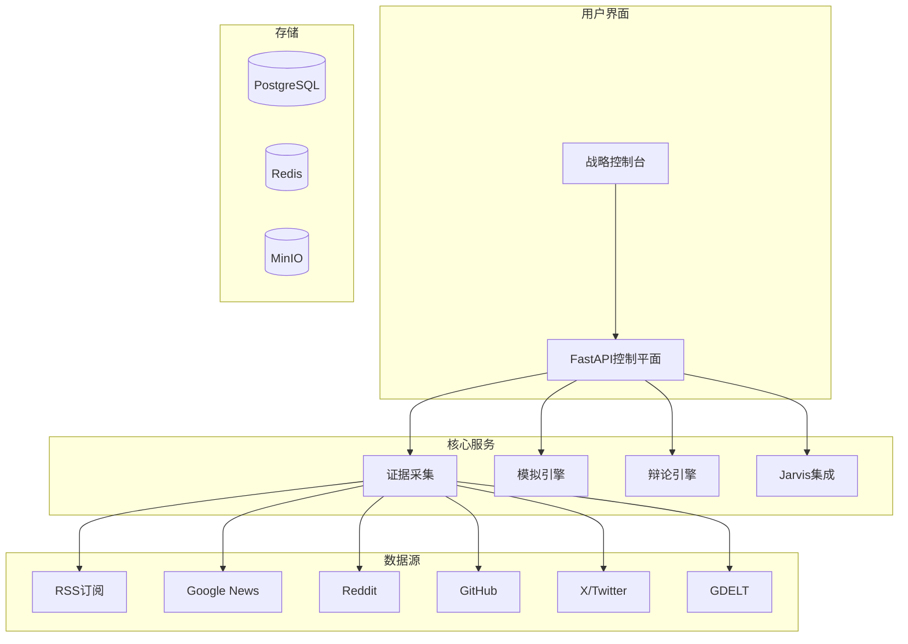

<div align="center">

# 明鉴 (MingJian)

### *明察秋毫，鉴往知来*

**AI驱动的多代理平台 | 证据驱动的场景模拟与战略决策**

[](https://opensource.org/licenses/MIT)
[](https://www.python.org/downloads/)
[](https://fastapi.tiangolo.com/)
[](https://nextjs.org/)
[](https://www.typescriptlang.org/)
[](https://github.com/dashitongzhi/mingjian/stargazers)
[](https://github.com/dashitongzhi/mingjian/network/members)

**🌐 语言选择 / Language Selection**

[**🇬🇧 English**](README.md) | [**🇨🇳 中文**](README.zh-CN.md)


---

## 🏆 为什么明鉴是决策智能的未来

> **"第一个将证据驱动分析、多代理辩论和实时模拟统一在一个工作空间中的开源平台。"**

明鉴不仅仅是一个AI工具——它是组织进行战略决策方式的**范式转变**。通过结合10+实时数据源、对抗性多代理辩论和确定性决策追踪，明鉴消除了困扰传统AI系统的"黑箱"问题。

---

</div>

## 🌟 为什么选择明鉴？

<div align="center">

### 🔬 证据驱动，非猜测驱动

</div>

与传统模拟平台不同，明鉴的每个决策都基于来自**10+数据源的真实证据**（Google News、Reddit、GitHub、X/Twitter、GDELT、RSS订阅、天气、航空数据）。每个声明可追溯，每个决策可审计。

<div align="center">

### 🤖 多代理辩论协议

</div>

关键决策经过**严格的多代理辩论**——多个AI模型（GPT、Gemini、Claude、Grok）从不同角度论证、挑战假设、达成有证据支持的结论。这不是简单的多模型，而是用于决策验证的**对抗性推理**。

<div align="center">

### 🎯 双领域专业能力

</div>

一个平台，两个领域：**企业**（市场分析、竞争情报、投资研究）和**军事**（作战规划、物流优化、威胁评估）。共享基础设施，领域特定规则。

<div align="center">

### 🔍 完全可审计的决策追踪

</div>

每个模拟产生**确定性决策追踪**——AI如何得出结论的逐步记录。没有黑箱。完全透明，用于合规、审查和学习。

<div align="center">

### 🛡️ Jarvis自我修复引擎

</div>

集成的AI运行时，用于**自我审查、交叉审查和自动修复**。系统审查自己的输出，识别弱点，并迭代直到达到质量阈值——全程无需人工干预。

<div align="center">

### ⚡ 实时流式分析

</div>

提交分析请求，实时观看AI工作——流式进度事件、来源归属和中间结果。无需等待黑箱完成。

---

## 🆚 与其他项目的对比

<div align="center">

### 详细对比

</div>

| 特性 | 明鉴 | 传统模拟 | 单代理AI | LangChain/AutoGen |
|------|------|----------|----------|-------------------|
| **数据源** | ✅ 10+实时源 | ❌ 仅手动输入 | ⚠️ 有限 | ⚠️ 有限 |
| **证据链** | ✅ 完全可追溯 | ❌ 无追踪 | ❌ 无追踪 | ❌ 无追踪 |
| **多代理辩论** | ✅ 对抗性推理 | ❌ 单模型 | ❌ 单模型 | ⚠️ 基础多代理 |
| **决策追踪** | ✅ 确定性可审计 | ❌ 黑箱 | ❌ 黑箱 | ❌ 黑箱 |
| **自我修复** | ✅ Jarvis引擎 | ❌ 无 | ❌ 无 | ❌ 无 |
| **流式分析** | ✅ 实时事件 | ❌ 仅批量 | ❌ 仅批量 | ⚠️ 有限 |
| **企业领域** | ✅ 完整支持 | ⚠️ 通用 | ❌ 通用 | ❌ 通用 |
| **军事领域** | ✅ 完整支持 | ⚠️ 通用 | ❌ 通用 | ❌ 通用 |
| **场景分支** | ✅ 束搜索 | ❌ 手动 | ❌ 无 | ❌ 无 |
| **知识图谱** | ✅ 嵌入支持 | ❌ 无 | ❌ 无 | ❌ 无 |
| **战略控制台** | ✅ 完整Web UI | ⚠️ 基础 | ❌ 仅CLI | ❌ 仅CLI |
| **辩论协议** | ✅ 支持方+挑战方+仲裁方 | ❌ 无 | ❌ 无 | ⚠️ 基础 |
| **来源健康监控** | ✅ 自动化 | ❌ 手动 | ❌ 无 | ❌ 无 |
| **Docker部署** | ✅ 一键 | ⚠️ 手动 | ❌ 无 | ⚠️ 手动 |
| **开源** | ✅ MIT许可 | ⚠️ 多样 | ⚠️ 多样 | ✅ 多样 |

<div align="center">

### 核心优势总结

```
明鉴 vs 其他：

证据驱动     ✅ vs ❌    不是猜测，是真实数据
多代理辩论   ✅ vs ❌    AI之间互相挑战验证
决策追踪     ✅ vs ❌    每一步都可审计
自我修复     ✅ vs ❌    系统自动审查改进
双领域支持   ✅ vs ❌    企业+军事全覆盖
实时流式     ✅ vs ❌    不用等待黑箱完成
知识图谱     ✅ vs ❌    语义搜索和关联
场景分支     ✅ vs ❌    多路径模拟对比
```

</div>

<div align="center">

### 适用场景对比

</div>

| 场景 | 明鉴 | 其他 |
|------|------|------|
| 投资决策前的市场调研 | ✅ 自动采集+分析+辩论 | ❌ 手动搜索+单模型总结 |
| 军事后勤规划 | ✅ 多源情报+实时模拟 | ❌ 静态分析+人工判断 |
| 竞争对手分析 | ✅ 10+来源+知识图谱 | ⚠️ 单一来源+简单分析 |
| 风险评估 | ✅ 多模型辩论+审计追踪 | ❌ 单模型+无追踪 |
| 战略规划 | ✅ 场景分支+KPI对比 | ❌ 单一方案+主观评估 |

---

## 🚀 核心功能

<div align="center">

| 功能 | 说明 | 图标 |
|------|------|------|
| **证据驱动智能** | 自动从10+源采集和分析数据 | 🔍 |
| **多代理辩论** | GPT、Gemini、Claude、Grok对抗性推理 | ⚖️ |
| **实时流式** | 实时观看AI工作进度 | ⚡ |
| **决策追踪** | 确定性、可审计的决策记录 | 📋 |
| **自我修复引擎** | 自动审查、交叉审查和修复 | 🛡️ |
| **双领域支持** | 企业+军事一个平台 | 🎯 |
| **知识图谱** | 嵌入支持的语义搜索 | 🧠 |
| **场景分支** | 束搜索多路径模拟 | 🌳 |

</div>

---

## 💡 为什么选择明鉴？

### **1. 基于证据的决策制定**
与传统模拟平台不同，明鉴将每个决策建立在真实世界证据之上。系统自动从10+源采集数据、验证声明，并维护完整的证据链以供审计。

### **2. 多代理辩论协议**
关键决策经过严格的多代理辩论，确保：
- **多元视角**来自不同AI模型
- **有证据支持的论点**带来源归属
- **透明推理**带完整审计追踪
- **冲突解决**通过结构化辩论协议

### **3. 双领域专业能力**
明鉴支持企业和军事两个领域：
- **企业**：市场分析、竞争情报、投资研究
- **军事**：作战规划、物流优化、威胁评估
- **共享**：风险管理、场景规划、战略前瞻

### **4. 生产就绪架构**
使用企业级技术构建：
- **FastAPI**用于高性能异步API
- **SQLAlchemy**用于健壮的数据库操作
- **Redis Streams**用于可扩展的事件处理
- **pgvector**用于AI驱动的相似性搜索
- **Docker Compose**用于轻松部署

### **5. 可扩展和可定制**
- **基于YAML的配置**用于规则和模型
- **插件架构**用于自定义数据源
- **API优先设计**用于与现有系统集成
- **开源**MIT许可，最大灵活性

---

## 🎯 使用场景

<div align="center">

| 场景 | 说明 | 收益 |
|------|------|------|
| **企业战略** | 市场分析、竞争情报、场景规划 | 数据驱动决策 |
| **军事规划** | 作战分析、物流模拟、威胁评估 | 战略优势 |
| **风险管理** | 基于证据的风险评估，多视角验证 | 减少不确定性 |
| **投资研究** | 数据驱动的投资论文开发和压力测试 | 更好回报 |
| **政策分析** | 多利益相关者影响评估和场景建模 | 明智政策 |

</div>

---

## 📦 快速开始

### 前置要求

- Python 3.12+
- Node.js 18+（用于前端）
- PostgreSQL（可选，开发用SQLite）
- Redis（可选，用于事件总线）

### 安装

```bash
# 克隆仓库
git clone https://github.com/dashitongzhi/mingjian.git
cd mingjian

# 后端设置
python -m venv .venv
source .venv/bin/activate  # Windows: .venv\Scripts\activate
pip install -e ".[dev]"

# 前端设置
cd frontend
npm install
cd ..
```

### 配置

```bash
# 复制示例配置
cp .env.example .env

# 配置环境变量
# 必需：PLANAGENT_OPENAI_API_KEY用于AI功能
# 可选：PostgreSQL、Redis和其他服务连接
```

### 运行应用

**后端（FastAPI）：**
```bash
uvicorn planagent.main:app --reload
```

**前端（Next.js）：**
```bash
cd frontend
npm run dev
# 打开 http://localhost:3000
```

**生产构建：**
```bash
cd frontend
npm run build
npm start
# 或使用Docker
docker build -t mingjian-frontend .
docker run -p 3000:3000 mingjian-frontend
```

**替代打包选项：**
```bash
# 独立构建（默认）
npm run package:standalone

# 静态导出（用于CDN部署）
npm run package:static

# Docker构建
npm run package:docker

# 预览生产构建
npm run preview
```

### 提交您的第一次分析

```bash
# 企业分析
curl -X POST http://127.0.0.1:8000/analysis \
  -H "Content-Type: application/json" \
  -d '{
    "content": "分析AI芯片制造最新进展",
    "domain_id": "corporate",
    "auto_fetch_news": true,
    "include_google_news": true,
    "include_reddit": true,
    "include_hacker_news": true
  }'

# 军事分析
curl -X POST http://127.0.0.1:8000/analysis/stream \
  -H "Content-Type: application/json" \
  -d '{
    "content": "评估东部战区后勤保障挑战",
    "domain_id": "military",
    "auto_fetch_news": true
  }'
```

---

## 🏗️ 架构

<div align="center">



</div>

---

## 📁 项目结构

```
├── src/planagent/           # Python后端
│   ├── api/                 # FastAPI路由和依赖
│   ├── core/                # 数据库、配置、日志
│   ├── models/              # SQLAlchemy ORM模型
│   ├── services/            # 业务逻辑服务
│   ├── engine/              # 模拟引擎和动作
│   ├── rules/               # 基于YAML的规则定义
│   └── worker/              # 后台任务处理
├── frontend/                # Next.js前端
│   ├── src/app/             # React页面和组件
│   ├── src/lib/             # API客户端和工具
│   └── public/              # 静态资源
├── migrations/              # Alembic数据库迁移
├── evidence/                # 证据相关模块
├── minio/                   # 对象存储集成
├── postgres/                # PostgreSQL配置
└── scripts/                 # 工具脚本
```

---

## 🧪 测试

```bash
# 运行所有测试
pytest

# 运行带覆盖率
pytest --cov=planagent

# 运行特定测试文件
pytest tests/test_debate.py

# 运行带详细输出
pytest -v
```

---

## 📚 文档

- [完整技术报告](docs/planagent_full_report.md)
- [Agent启动手册](docs/agent_startup_playbook.md)
- [技术债务积压](TECHNICAL_DEBT_BACKLOG.md)
- [贡献指南](CONTRIBUTING.md)
- [变更日志](CHANGELOG.md)

---

## 🤝 贡献

我们欢迎贡献！请参阅我们的[贡献指南](CONTRIBUTING.md)了解详情。

```bash
# Fork仓库
# 创建功能分支
git checkout -b feature/amazing-feature

# 进行更改
# 运行测试
pytest

# 提交更改
git commit -m "feat: add amazing feature"

# 推送到分支
git push origin feature/amazing-feature

# 打开Pull Request
```

---

## 📄 许可证

本项目根据MIT许可证授权 - 详见[LICENSE](LICENSE)文件。

---

## 🙏 致谢

- 使用[FastAPI](https://fastapi.tiangolo.com/)构建
- 前端由[Next.js](https://nextjs.org/)驱动
- 数据库：[PostgreSQL](https://www.postgresql.org/) + [pgvector](https://github.com/pgvector/pgvector)
- 事件流：[Redis Streams](https://redis.io/docs/data-types/streams/)
- 对象存储：[MinIO](https://min.io/)

---

## 📞 支持

- 📧 邮箱：[Your Email]
- 🐛 问题：[GitHub Issues](https://github.com/dashitongzhi/mingjian/issues)
- 💬 讨论：[GitHub Discussions](https://github.com/dashitongzhi/mingjian/discussions)

---

<div align="center">

## 🌟 Star历史

[](https://star-history.com/#dashitongzhi/mingjian&Date)

---

**明鉴** — *明察秋毫，鉴往知来*

**明鉴** — *See Clearly, Judge Wisely*

**明鉴** — *Forge Your Decisions with AI*

**明鉴** — *Evidence-Driven, Debate-Tested, Decision-Ready*

---

**由明鉴团队用❤️制作**

</div>
